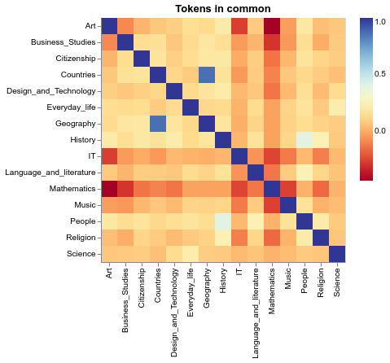
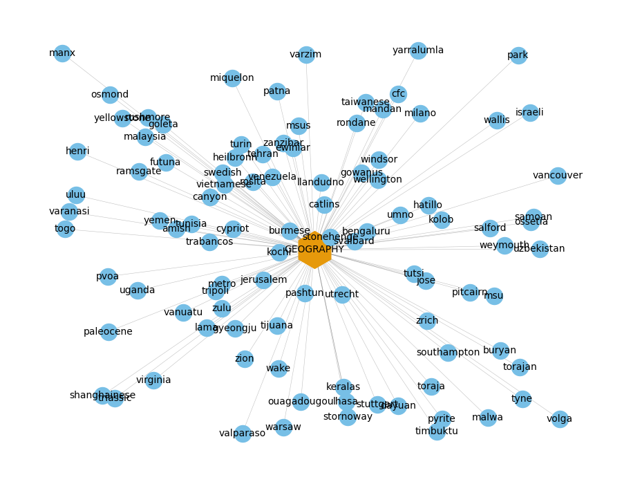

#### *Developed 12 I 2022*
# University project: Complex networks -- Analysis of token relationships from Wikipedia Article Networks

Data source: [Rozemberczki et al., Wikipedia Article Networks, Stanford University SNAP Database, 2019](https://snap.stanford.edu/data/wikipedia-article-networks.html)

## Example visualizations

> Countries have 99.37% of tokens in common with Geography  
> Art have 56.39% of tokens in common with History  
> Business_Studies have 49.50% of tokens in common with Geography  
> Mathematics have 43.67% of tokens in common with People  
> Music have 41.01% of tokens in common with People  
> Religion have 39.66% of tokens in common with History  
> Language_and_literature have 38.76% of tokens in common with People  
> Citizenship have 38.48% of tokens in common with Geography  
> Design_and_Technology have 37.95% of tokens in common with Geography  
> IT have 36.12% of tokens in common with People  
> Geography have 35.93% of tokens in common with Countries  
> History have 34.26% of tokens in common with People  
> Everyday_life have 29.51% of tokens in common with Science  
> People have 28.54% of tokens in common with History  
> Science have 19.93% of tokens in common with Geography  

